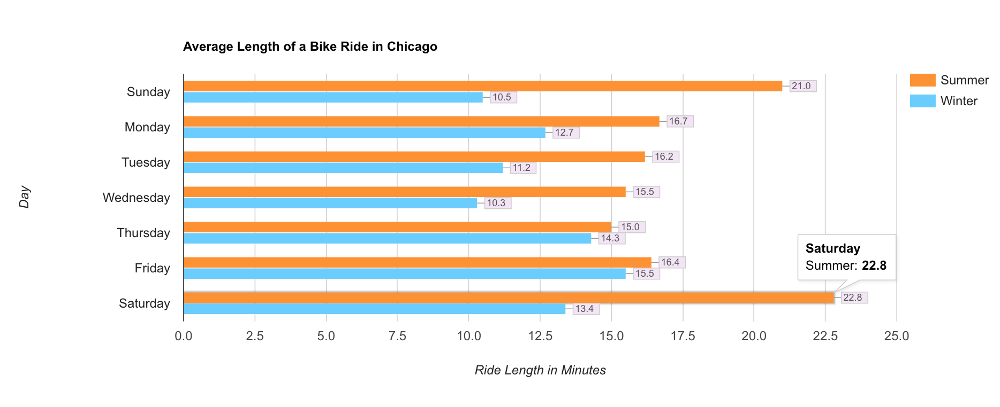

# Bike Riding in Chicago: Summer vs Winter
My goal here was to compare the lengths of rides taken in summer and winter with data from Chicago's bikeshare system Divvy. Divvy opens much of its ridership data up to developers, [which can be viewed in full here](https://www.divvybikes.com/system-data).

## Methodology

As an avid user of the Divvy system, my first step was to download some of the past data to see what questions could be answered. Having many times undertaken the mental calculus of whether I should ride Divvy or take a train or bus, especially as the weather begins to turn, I was curious what impact that might have on ridership. My first idea for solving for this involved taking the pick up and drop off points, running them through a Google Maps API, and getting back a precise distance traveled. 

However, the available data gives us the duration of the ride, and if we don't mind reasonably assuming that people are riding for a majority of the time they have the bike checked out, this is a decent placeholder for distance traveled. (Note: Divvy has fines in place for keeping a bike too long, so we can figure folks aren't checking out bikes to stash them under their porch.)

The first data set I looked at was from 2018 Q1, so I figured I'd compare the first full week of January with its counterpart six months earlier. However, that summer week covers the Fourth of July. In order to not have the data potentially skewed by the holiday, I shifted the dataset to cover the first full weeks of February and August.

## Execution

My first step was to write files in Python that would act as parsers. These files each take in a CSV file of Divvy trips, grab the duration off of each individual trip, and put that duration into one of seven lists, one for each day of the week. At the bottom of the file, we call for an average on each of these lists, then put that average along with a corresponding day label into a new CSV.

The differences between the two parser files are largely semantic due to differences in the Q1 2018 and Q3 2017 datasets. They could be rewritten as a single parser in the future, using an ARGV input to indicate the CSV file to intake. For now, the filenames are hardcoded in each.

From there, I took the data and built my visualization. Unable to open the CSV files within the Javascript file that contains the code for the Google visualization, I input that data manually. The result can be seen below or by cloning this repo and opening locally.

## Conclusion

It would appear, as you might expect, that Chicagoans are less inclined to go for long bike rides in the winter than in the summer. The average ride was longer in the summer for each day we checked with the starkest differences coming on Saturday (21.0 mins vs 10.5) and Sunday (22.8 vs 13.4). Friday was very close (16.4 vs 15.5), which may owe to the fact that there's one ride in particular in February that lasted more than 25 hours. However, I didn't examine each of the days for outliers due to the size of the dataset and this may be par for the course. More analysis would be needed to draw a conclusion there.

## What's Next?

Two things I might do to expand this particular visualization would be to add bars for May and November to capture all four seasons. It would also be a good idea to augment the sample size by include those full months rather than just a one-week snapshot.
